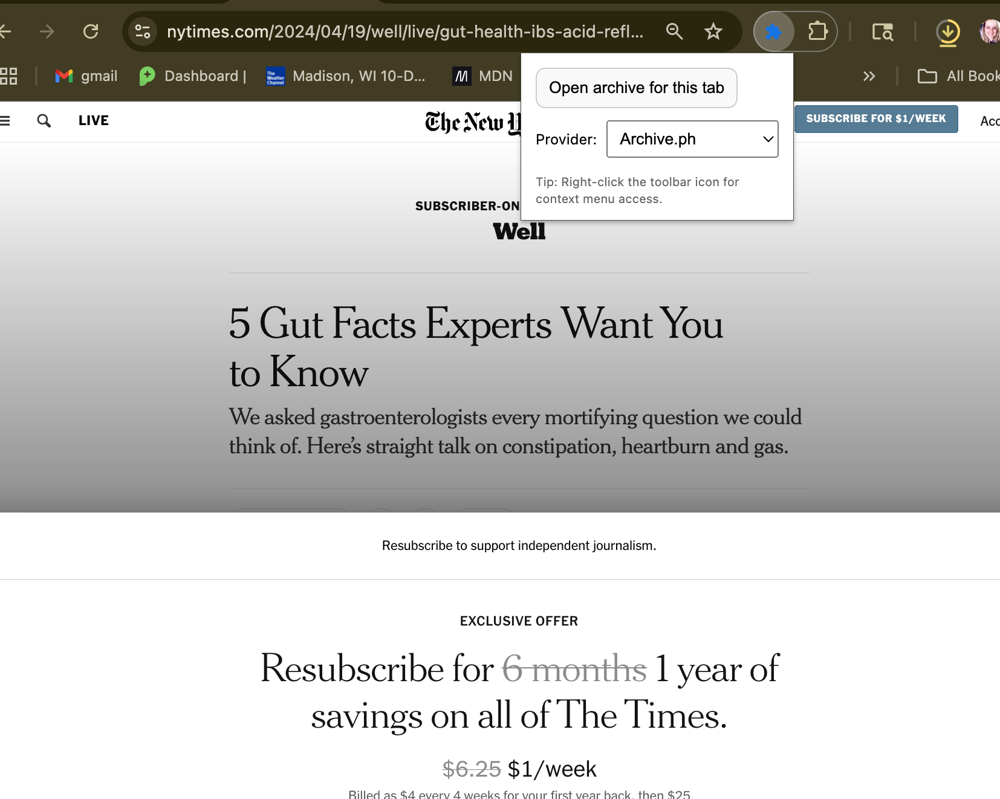
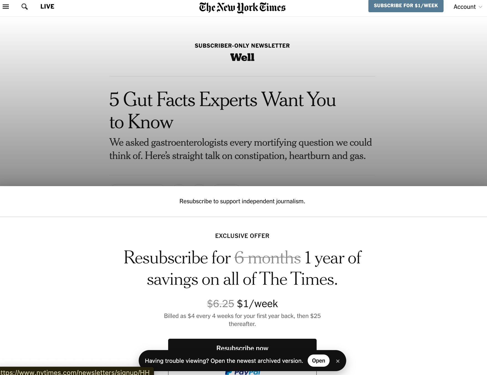

# Archive Reader — Chrome Extension (MV3)


**Archive Reader** lets you instantly open the **newest archived version** of any webpage using:

- [Wayback Machine](https://web.archive.org/)
- [Archive.ph](https://archive.ph/)

It can also detect common paywalls and offer a quick “Open archived version” button.

---

## 🚀 Features

- Always opens the **latest** snapshot (Wayback: `/0/`, Archive.ph: `/latest/`).
- Toolbar button to open archives for the current page.
- Paywall detection banner.
- Choice of provider saved in extension settings.

---

## 📸 Screenshots

_(Replace with your actual captures)_



---

## 🛠 Installation (Developer Mode)

1. Clone or download this repo

```bash
git clone https://github.com/patsylin/open-archived-version.git
cd open-archived-version
```
